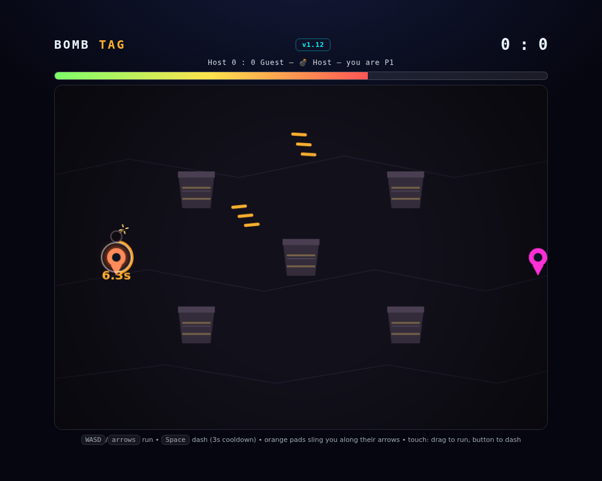
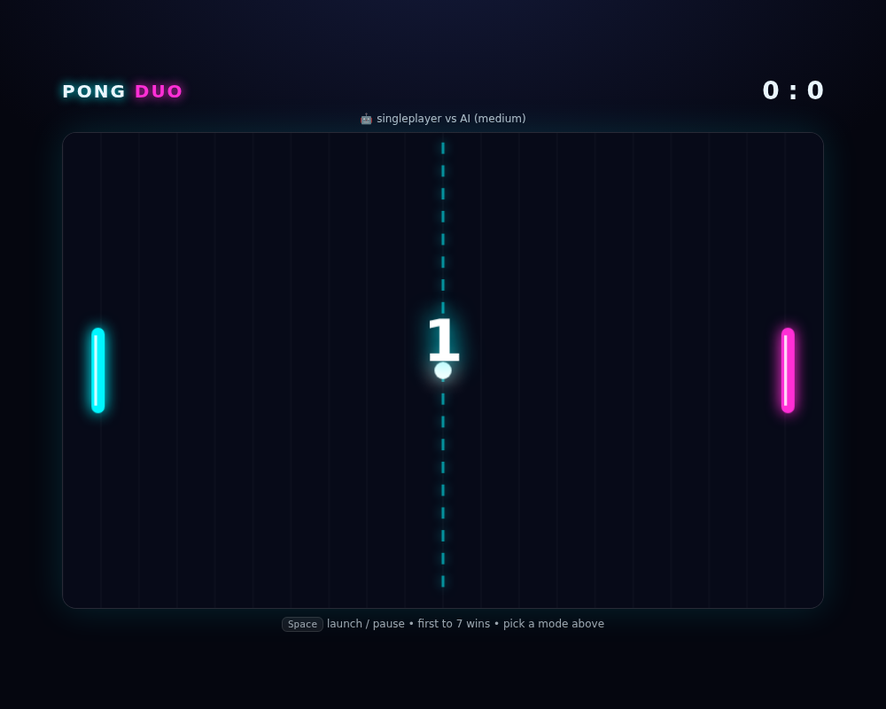

# 🎮 Local Browser Games

Zero installs (besides Python for the LAN ones), zero internet needed.

**Easiest start:** each game folder has `start-linux.sh` (double-click or `./start-linux.sh`, Ctrl+C stops the server) and `start-windows.bat` (double-click, needs Python) — they boot the server (LAN games) and open the game in your browser.

## 1player — solo, just open `index.html`

- `1player/breakout-blast/` — Breakout Blast brick-breaker

## 2players — LAN duel: host runs the server, both open the printed `http://<host-ip>:<port>` URL on the same Wi-Fi

- `2players/tank-duel/` — Tank Duel → `:3001`
- `2players/bomb-tag/` — Bomb Tag → `:3002`

## hybrid1-2 — solo or 2-player

- `hybrid1-2/neon-pong/` — Neon Pong Showdown, 2P LAN + solo vs AI → `:3000`
- `hybrid1-2/pong-duo/` — Pong Duo, solo vs AI or 2P on one keyboard, just open `index.html`

