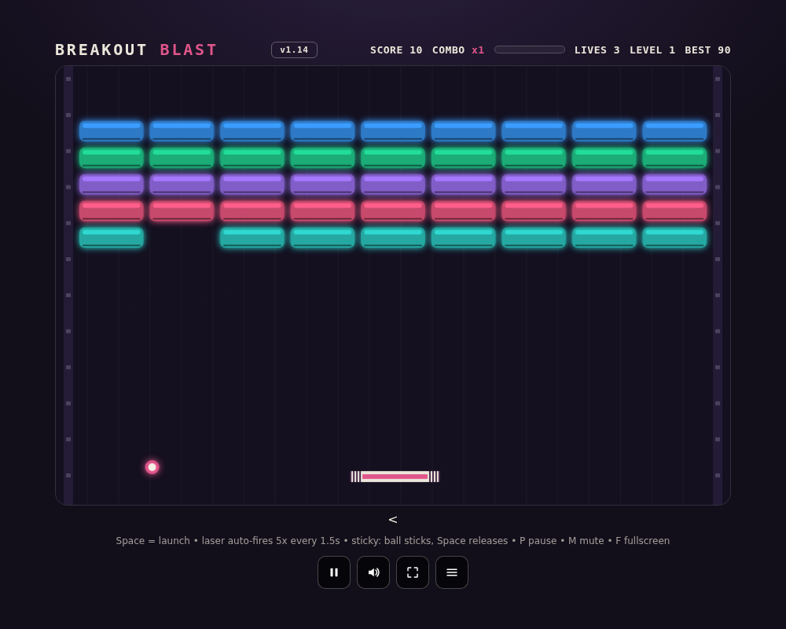

# Breakout Blast — Solo 🧱

Smash all bricks. Chain bricks without touching the paddle for **COMBO x5**. 💣 bombs explode neighbors, armored bricks need extra hits (🔥 fire melts them).

**📅 Daily challenge** (same seeded levels for everyone, all day, separate best) and
**▼ pressure**: a fresh row descends every ~12–26s — clear fast or get overrun.

Powers: ⬌ expand • 🐢 slow • ✨ multi • ❤ life • 🔥 fire • 🔫 laser • 🩹 sticky • 🛡 shield (saves 1 miss).

## Run

Just open `index.html` (or `./start-linux.sh` / `start-windows.bat`). No server needed.

## Controls

Mouse / `←` `→` / touch (hold LEFT or RIGHT half) — move. `Space` — launch, release sticky (laser auto-fires). `F` fullscreen (touch: rotate sideways; mid-line shows the two zones). `P` pause, `M` mute. Best score is saved in the browser.
