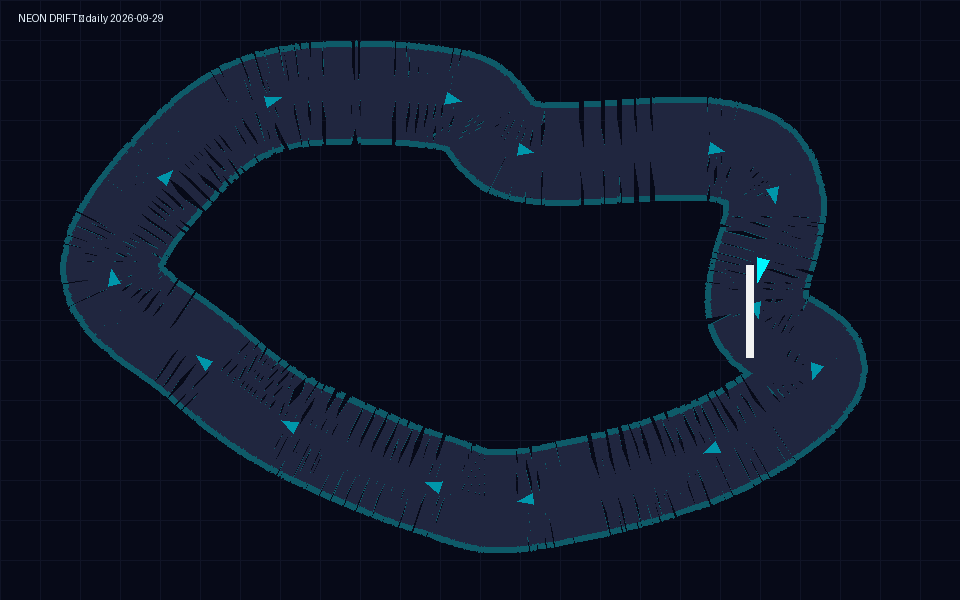

# Neon Drift — Solo 🏁

Top-down time-trial racer. A fresh seeded track every day — same for everyone, all day.
Nail every apex — cutting the track invalidates the lap. Top runs are saved **per day**
(browse days with ◀ ▶): the top 3 race with you as live ghosts, with live Δ vs your best
and sector splits every quarter. Watch the best back, export it as JSON, or import a rival's.

## Run

Just open `index.html` (or `./start-linux.sh` / `start-windows.bat`). No server needed.

## Controls

`WASD` / arrows drive • `Space` handbrake • `R` reset to track • `T` restart lap •
`G` rival ghost • `F` fullscreen • `P` pause, `M` mute, `Esc` menu. Touch: ▲ gas, ▼ brake, ◀ ▶ steer, HB handbrake.
On touch devices, rotating sideways switches the game to fullscreen (tap the ⛶ prompt if the browser asks).
System buttons (pause / ghost / menu / sound) sit below the track, never over it.
Race your day's best live as a magenta ghost. Best lap + top runs are saved in the browser.
