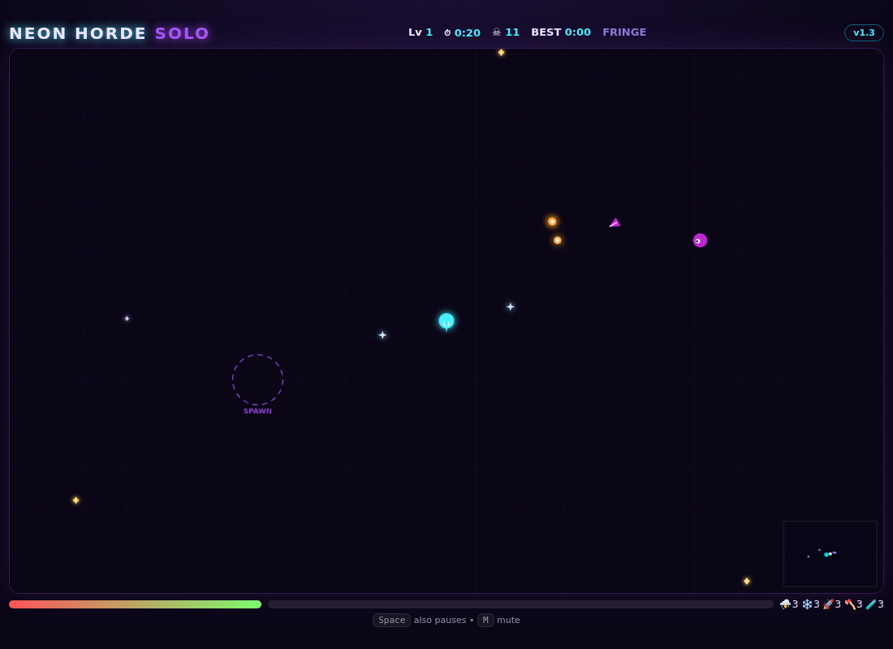

# Neon Horde Solo — Static Survivors 👾

**VOID CORRUPTION theme:** light-bearer hunter versus the violet abyss. The single-file version of LAN Neon Horde: **infinite field** with follow camera, minimap and boss arrow, **meadow → ember → void** biomes, splitters, dash-chargers, greed goblins, **blood moons** — but the game **pauses** for drafts and death ends the run. Best time is saved in the browser.

**Arsenal (8):** orbit blades, bolt spitter, nova pulse, **chain lightning** (jumps, falls off), **frost orbitals** (chill), **homing missiles** (splash), **boomerang axe** (out-and-back), **acid pools** (melt the pack). Maxed weapon + artifact = evolution.

## Run

Just open `index.html` (or `./start-linux.sh` / `start-windows.bat`). No server needed.

## Controls

- `WASD`/arrows to move (weapons fire themselves)
- Draft: `1` `2` `3` or click/tap the card
- `Space`/`P` pause, `M` mute, touch: drag to move
