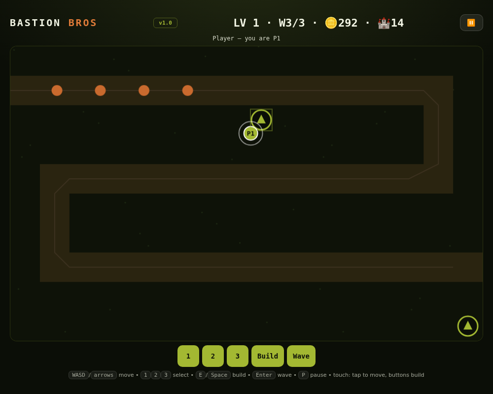

# Bastion Bros LAN — Co-op Tower Defense 🏰



`2players/bastion/` — the LAN edition: 2–4 defenders, each on their own
screen (phone-friendly tap-to-move + buttons). Server holds the grid,
gold, waves and enemies; same rules as static Bastion Bros.

```bash
python3 server.py        # serves on :3005 by default (PORT=xxxx to change)
```

Host opens `http://localhost:3005`, defenders open `http://<host-ip>:3005`.
Enter names → Join → Ready (2+ ready starts it).
