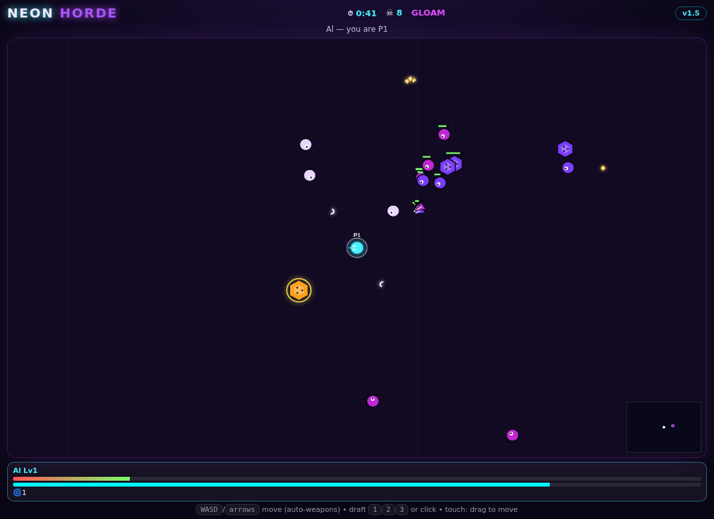

# Neon Horde — LAN Co-op Survivors 👾



**VOID CORRUPTION theme:** light-bearer hunters versus the violet abyss. 2–4 hunters, **infinite field** — no walls, your camera follows you, minimap + edge arrows track the pack (and the boss). Roam outward through **meadow → ember → void** biomes: tougher enemies, richer gems. Endless swarm, per-player level drafts (pick 1 of 3, only you freeze), elites, a boss every 4 minutes, touch-to-revive. Full wipe ends the run.

**Arsenal (8):** orbit blades, bolt spitter, nova pulse, **chain lightning**, **frost orbitals**, **homing missiles**, **boomerang axe**, **acid pools**.

**Threats:** splitters burst into chasers, chargers telegraph dashes, greed goblins flee with gem showers, and every 3rd minute is a **blood moon** (2x spawns, 2x XP). Max a weapon with its artifact for an **evolution**: Soul Reaper executes, Oracle bolts seek, Thorn Nova slows. Downed hunters bleed out in 25s — touch to revive in time.

## Run

```bash
python3 server.py        # serves on :3003 by default (PORT=xxxx to change)
```

Host opens `http://localhost:3003`, hunters open `http://<host-ip>:3003`. Enter names → Join → Ready (1+ hunters starts it, late joiners drop in shielded).

## Controls

- `WASD`/arrows to move (weapons fire themselves)
- Draft: `1` `2` `3` or click/tap the card
- Touch: drag to move

## Survive guide

- Grab gems (cyan small, gold big). Draft weapons early: blades for crowds, bolts for range, nova for breathing room.
- Elites glow gold and burst gems. Bosses drop gem showers + team heal.
- Downed? Crawl next to an ally — 3s channel revives at half HP.
