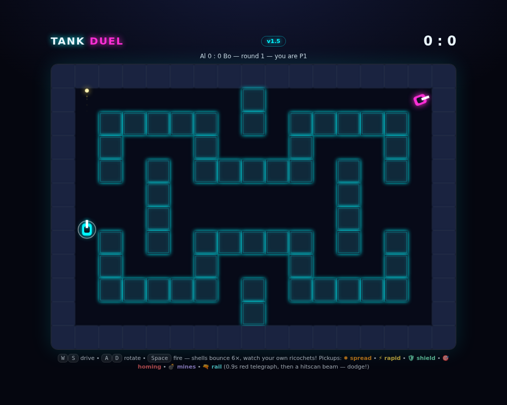

# Tank Duel — LAN 2P 🤖



Real-time maze tanks on a 17×12 arena. Shells bounce off walls 6× (watch your own ricochets — they kill you too after the 0.4s arming grace). Weapon pickups spawn around the map: **✹ spread shot**, **⚡ rapid fire**, **🛡 shield** (absorbs one shell), **🎯 homing shells** (steer at the foe), **💣 mines** (fire lays up to 3, armed after 1s, splash both), **🔫 railgun** (hold nothing — press fire to start a 0.9s red telegraph, then an instant wall-blocked beam; dodge sideways!). First to 5 rounds wins.

## Run

```bash
python3 server.py        # serves on :3001 by default (PORT=xxxx to change)
```

Host opens `http://localhost:3001`, friend opens `http://<host-ip>:3001`. Enter names → Join → Ready.

## Controls

- `W`/`S` drive, `A`/`D` rotate, `Space` fire (arrows work too)
- Touch: drag left half to steer, tap/hold right side to fire
