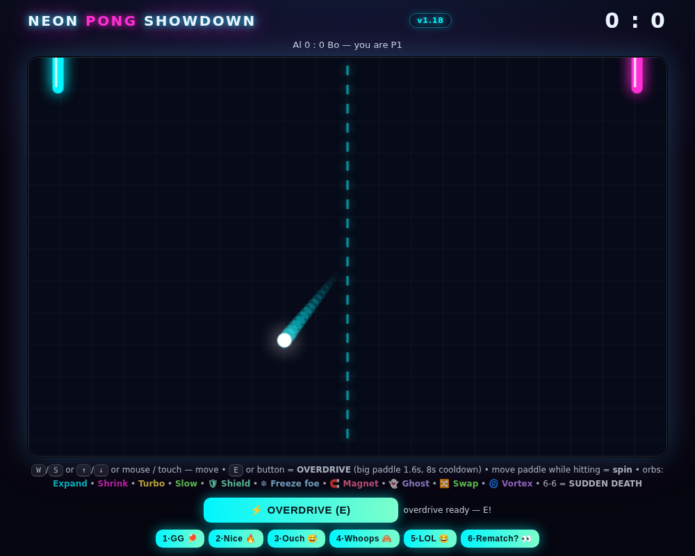

# Neon Pong Showdown — LAN 2-player 🏓 (v1.38)



You chose **Neon Pong Showdown**. First to 7 wins (changeable in the lobby: 3/5/7/11). Power-up orbs included.

No internet needed. Zero installs (Python stdlib only).

## Run it

On the **host laptop** (both players must be on the same Wi-Fi):

```bash
python3 server.py
```

You'll see something like:

```
On this laptop:        http://localhost:3000
Friend on same WiFi:   http://192.168.0.240:3000
```

- Host opens `http://localhost:3000`
- Friend opens `http://192.168.x.x:3000` on their phone/laptop browser
- Both: enter name → **Join game** → **Ready up ⚡**
- Alone? Hit **🤖 Solo vs AI** in the lobby — the server drives P2.

## Controls

- `W`/`S` or `↑`/`↓`, or mouse-drag / touch
- P1 = left (cyan), P2 = right (pink)

## Power-ups (hit the orb with the ball)

- Cyan `⇕` — Expand you (10s)
- Pink `⇩` — Shrink foe (10s)
- Yellow `⚡` — Turbo ball
- Green `◔` — Slow ball
- Teal `🛡` — Shield: blocks one goal on your side
- Ice `❄` — Freeze: foe's paddle frozen 2.5s
- Magnet `🧲` — incoming balls on your half bend toward you (8s)
- Ghost `👻` — the ball turns invisible to your foe (2.5s)
- Swap `🔀` — paddles trade places
- Vortex `🌀` — gravity well bends nearby shots (4.5s)

## New mechanics

- **Spin shots**: move your paddle while hitting — velocity curves the ball.
- **Overdrive**: `Shift` or the on-screen button — paddle grows 1.6x for 1.6s, 8s cooldown.
- **Sudden death**: at 6–6 paddles shrink to 64px and the ball heats up every tick. Win it or else.

## Files

- `server.py` — game server (authoritative, 60Hz), serves `public/`
- `public/index.html` — full game client (canvas + polling, no deps)

## Troubleshooting

- Friend can't connect? Check same Wi-Fi, allow Python through firewall, try `http://<host-ip>:3000`.
- Port busy? Run `PORT=3001 python3 server.py`.
- Someone disconnected? Slots free up after ~8s; just re-join.
